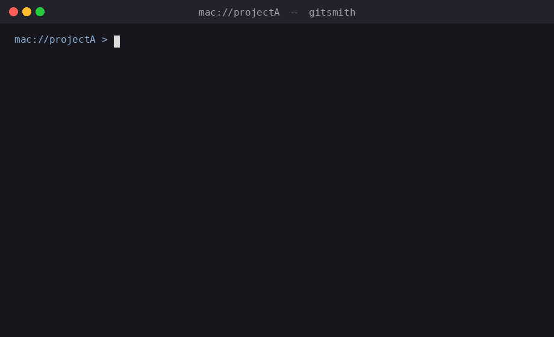

# gitsmith

GitSmith: AI powered configurable conventional commits CLI for teams and solo developers.

[](https://www.npmjs.com/package/gitsmith)
[](https://www.npmjs.com/package/gitsmith)
[](https://github.com/chapeee/gitsmith/blob/main/LICENSE)
[](https://nodejs.org/)
[](https://github.com/chapeee/gitsmith/pulls)
[](https://github.com/chapeee/gitsmith/issues)

**gitsmith** is a AI powered configurable Conventional Commits CLI that adapts to every project through a single `.commitconfig.json` file. Install it once globally, drop a config in any repo, and ship clean, consistent commits every time. Optional AI assist turns "what did you do?" into a perfectly formatted commit using a free NVIDIA model, so you stop fighting the type, scope, and wording every time you commit.

## Screenshots

### Commit flow



### AI flow (NVIDIA API)

Use `gitsmith --ai` to force the AI prompt and generate suggestions from your NVIDIA AI API key.

## Quick Links

- [Features](#features-v1)
- [Quick Start](#quick-start)
- [Commands](#commands)
- [AI-assisted commits](#ai-assisted-commits)
- [Local Development](#local-development)
- [Open Source](#open-source)

## Why GitSmith

- Keeps commit messages consistent across teams and repos
- Supports custom project formats through `.commitconfig.json`
- Uses optional NVIDIA AI API suggestions for faster commit writing
- Falls back to manual prompts when AI is disabled or key is missing
- Runs safety checks before commit to reduce mistakes

## Features (v1)

- Project-aware commit format via `.commitconfig.json`
- Interactive prompts powered by `enquirer`
- Config validation with clear errors (`zod`)
- Config file discovery by walking up directories (`find-up`)
- Git safety checks (must be git repo, must have staged files)
- Commit preview + confirmation before running `git commit`
- `init` command that generates a conventional default config
- Optional AI suggestions powered by the NVIDIA AI API

## Install

```bash
npm install -g gitsmith
```

Then run the CLI command:

```bash
gitsmith --help
```

## Quick Start

1. Go to your project:

```bash
cd your-project
```

1. Initialize config:

```bash
gitsmith init
```

1. Edit `.commitconfig.json` as needed.
2. Stage files:

```bash
git add .
```

1. Run commit flow:

```bash
gitsmith
```

## Commands

- `gitsmith` or `gitsmith commit`: Start interactive commit flow
- `gitsmith --ai`: Force AI prompt for this run
- `gitsmith --no-ai`: Skip AI prompt for this run
- `gitsmith init`: Create `.commitconfig.json` in current directory
- `gitsmith init --force`: Overwrite existing config
- `gitsmith key:set [key]`: Save or overwrite NVIDIA API key
- `gitsmith key:show`: Show masked key
- `gitsmith key:remove`: Remove saved key
- `gitsmith key:reset`: Alias for `key:remove`
- `gitsmith key:status`: Show saved key status

## Config Schema

`.commitconfig.json` supports:

- `types: string[]` (required)
- `askScope: boolean` (required)
- `scopes?: string[]`
- `askTicket: boolean` (required)
- `ticketPrefix?: string`
- `askBreaking: boolean` (required)
- `format: string` (required)
- `headerMaxLength?: number`

Available format tokens:

- `{type}`
- `{scope}`
- `{ticket}`
- `{message}`
- `{breaking}` (`!` when true, otherwise empty)

### Default Config

```json
{
  "types": ["feat", "fix", "docs", "chore", "refactor", "test", "style"],
  "askScope": true,
  "scopes": ["auth", "ui", "api", "db", "config"],
  "askTicket": false,
  "askBreaking": true,
  "format": "{type}({scope}): {message}",
  "headerMaxLength": 72,
  "ai": {
    "enabled": true,
    "askByDefault": true
  }
}
```

## Example

Given:

- `type = feat`
- `scope = auth`
- `ticket = PROJ-123`
- `message = add login flow`

and format:

```text
{type}({scope}): {ticket} {message}
```

final commit header:

```text
feat(auth): PROJ-123 add login flow
```

## AI-assisted commits

AI is optional and fully additive. If your project has no `ai` block, behavior stays exactly the same.

### Quick start

```bash
npm install -g gitsmith
gitsmith key:set
gitsmith
```

### NVIDIA AI API key

Get a free key from [build.nvidia.com](https://build.nvidia.com).

### Enable AI in `.commitconfig.json`

```json
{
  "types": ["feat", "fix", "docs", "chore", "refactor", "test", "style"],
  "askScope": true,
  "scopes": ["auth", "ui", "api", "db", "config"],
  "askTicket": false,
  "askBreaking": true,
  "format": "{type}({scope}): {message}",
  "ai": {
    "enabled": true,
    "provider": "nvidia",
    "model": "nvidia/llama-3.3-nemotron-super-49b-v1",
    "endpoint": "https://integrate.api.nvidia.com/v1/chat/completions",
    "askByDefault": true,
    "allowNewScopes": true
  }
}
```

### Key management

| Command                  | Purpose                         |
| ------------------------ | ------------------------------- |
| `gitsmith key:set`       | Prompt and save key             |
| `gitsmith key:set <key>` | Save key non-interactively      |
| `gitsmith key:show`      | Show masked key                 |
| `gitsmith key:remove`    | Remove key after confirmation   |
| `gitsmith key:reset`     | Alias for `key:remove`          |
| `gitsmith key:status`    | Show provider/source/saved time |

### CI and scripting

Set `GITSMITH_AI_KEY` in the environment. It overrides the saved local file.

### Privacy note

Only the free-text description entered by the user is sent to AI. Source code and git diffs are not sent.

### AI flags

- `gitsmith --ai`: force AI prompt for this run
- `gitsmith --no-ai`: skip AI prompt for this run

## Local Development

```bash
npm install
npm link
```

Now test in any git repo:

```bash
gitsmith init
git add .
gitsmith
```

## Publish Checklist

- Set final npm package name in `package.json`
- Ensure version is correct (first release: `0.1.0`)
- Run:

```bash
npm run lint
npm publish
```

## Open Source

- License: MIT
- Contributions welcome via pull requests
- See `CONTRIBUTING.md` and `CODE_OF_CONDUCT.md`
